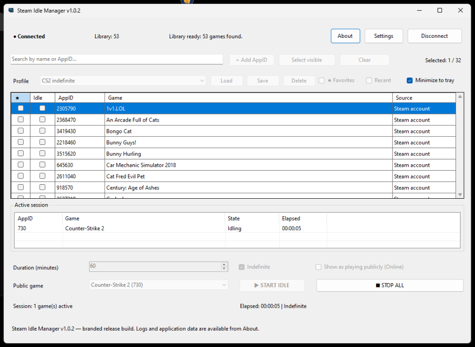

<p align="center">
  
</p>

<h1 align="center">Steam Idle Manager</h1>

<p align="center">
  A Windows desktop utility for managing Steam idle sessions across one or more AppIDs — without launching the actual games.
</p>

<p align="center">
  <a href="https://github.com/SebaGutierrezF/steam-idle-manager/releases/latest">
    
  </a>
  
  
  <a href="LICENSE">
    
  </a>
  <a href="https://www.buymeacoffee.com/SebaGutierrezF">
    
  </a>
</p>

<p align="center">
  <a href="https://github.com/SebaGutierrezF/steam-idle-manager/releases/latest"><strong>Download latest release</strong></a>
  ·
  <a href="#features">Features</a>
  ·
  <a href="#security--privacy">Security</a>
  ·
  <a href="#building-from-source">Build from source</a>
</p>

---

<p align="center">
  
</p>

## What is Steam Idle Manager?

Steam Idle Manager lets you report selected Steam AppIDs as being played while keeping the actual game executables closed.

It is designed for people who want a simple Windows GUI for managing one or multiple idle sessions, saved Steam accounts, profiles, visibility, automatic reconnects, and unattended startup.

## Features

- Idle **1 to 32 AppIDs simultaneously**
- No need to launch the actual game executables
- Fixed-duration or **indefinite** sessions
- Account library search and manual AppID fallback
- QR authentication
- Username/password authentication
- Steam Guard authenticator code support
- Steam Desktop Authenticator-friendly code entry
- Steam Guard email code support
- Multiple saved Steam accounts
- Windows DPAPI-protected remembered sessions
- Per-account library cache
- Public presence controls:
  - **OFF** → Steam persona stays Invisible
  - **ON** → Online + one preferred public game
- `STOP ALL` clears active AppIDs and returns the persona to **Invisible**
- Automatic reconnect during active idle sessions
- Restores AppIDs and presence after reconnect
- Saved idle profiles
- Favorites and recent games
- Active-session panel with elapsed time
- Minimize to system tray
- Auto-connect to a saved account
- Auto-start a saved profile
- Optional Start with Windows
- Persistent diagnostic logs
- Self-contained Windows x64 release build

## Download

Go to the [latest GitHub Release](https://github.com/SebaGutierrezF/steam-idle-manager/releases/latest) and download:

```text
SteamIdleManager-v1.0.2-win-x64.zip
```

Extract the ZIP and run:

```text
SteamIdleManager.exe
```

The release is self-contained for Windows x64.

## Authentication

When you click **Connect Steam**, you can choose QR, Username / Password, or a Saved account.

Steam Guard may ask for an authenticator code, Steam Desktop Authenticator code, email code, or mobile confirmation.

Steam Idle Manager does **not** store your password.

If you enable **Remember session**, the app can reuse Steam's refresh token without asking for QR/password every time.

## Security & privacy

Remembered Steam refresh tokens and Steam Guard data are protected using **Windows DPAPI with CurrentUser scope**.

Steam passwords are never persisted by Steam Idle Manager.

Local application data:

```text
%LOCALAPPDATA%\SteamIdleManager\
```

Diagnostic logs:

```text
%LOCALAPPDATA%\SteamIdleManager\logs\
```

Never publish Steam passwords, tokens, `.maFile` files, `shared_secret`, or `identity_secret`.

See [SECURITY.md](SECURITY.md).

## Presence behavior

| Action | Steam presence |
|---|---|
| Idle with public presence OFF | Invisible |
| Idle with public presence ON | Online + preferred public game |
| STOP ALL | Clears AppIDs + Invisible |
| Reconnect while private | Restores AppIDs + Invisible |
| Reconnect while public | Restores AppIDs + preferred public game |

## Profiles

Profiles are saved per Steam account and can include selected AppIDs, duration/Indefinite mode, public presence, and the preferred public game.

## Automatic operation

Steam Idle Manager can optionally start with Windows, start minimized, auto-connect a saved account, auto-start a profile, and recover automatically if Steam connectivity is interrupted.

`STOP ALL` always overrides automation and cancels active recovery.

## Building from source

### Requirements

- Windows 10/11
- [.NET 8 SDK](https://dotnet.microsoft.com/download/dotnet/8.0)

Run:

```bat
RUN_DEV.bat
```

For the final distribution build:

```bat
BUILD_RELEASE.bat
```

The release builder creates the versioned self-contained Windows x64 folder and ZIP under `release/`.

## Contributing

Bug reports, feature requests, and pull requests are welcome.

Please read [CONTRIBUTING.md](CONTRIBUTING.md) and [SECURITY.md](SECURITY.md) before posting logs or authentication-related information.

## Support the project

Steam Idle Manager is free and open source.

If it has been useful to you and you'd like to support continued development, bug fixes, and future features:

### ☕ [Buy Me a Coffee](https://www.buymeacoffee.com/SebaGutierrezF)

Thank you for supporting independent open-source development.

## License

Steam Idle Manager's own source code is released under the [MIT License](LICENSE).

Third-party components remain under their respective licenses. See [THIRD-PARTY-NOTICES.txt](THIRD-PARTY-NOTICES.txt).

## Disclaimer

Steam Idle Manager is an independent project and is **not affiliated with, endorsed by, or sponsored by Valve Corporation or Steam**.

Steam behavior and APIs may change over time. Use Steam Idle Manager only with accounts and AppIDs you are authorized to access.
